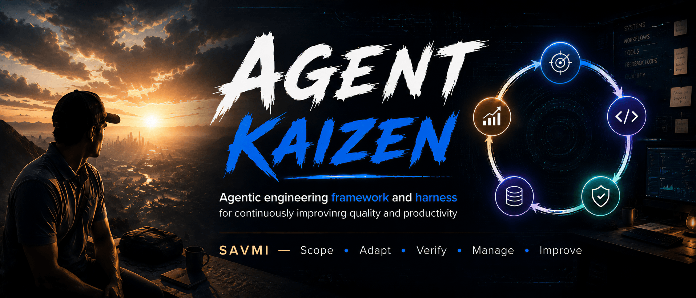
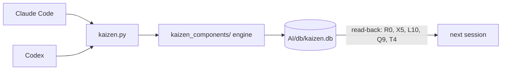
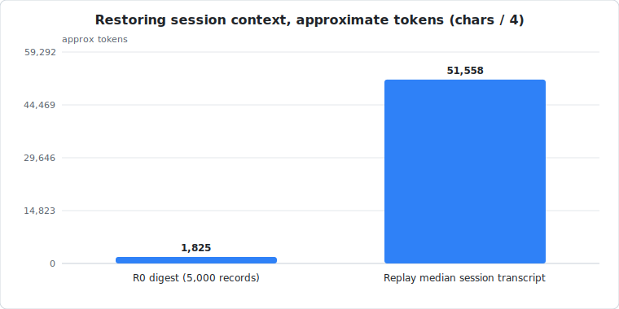
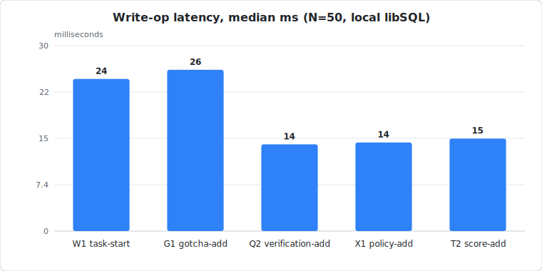

<p align="center">
  
</p>

# Agent Kaizen

[](LICENSE) [](https://github.com/LevyBytes/agent-kaizen/actions/workflows/tests.yml) [](#setup) [](https://github.com/LevyBytes/agent-kaizen)

Agent Kaizen is a practical reference implementation of my **Kaizen System** for AI coding-agent work in VS Code projects. Repo: <https://github.com/LevyBytes/agent-kaizen>.

Coding agents now remember things between sessions on their own. What they still do not give you is proof. Agent Kaizen is a local system of record that sits above the agents: every task, go/no-go verification result, artifact hash, prediction, and promoted lesson is written to one queryable database on your machine — by Claude Code and Codex through the same CLI — so the next session starts from recorded evidence instead of the agent's recollection. The method is a managed loop:

```text
SAVMI = Scope -> Adapt -> Verify -> Manage -> Improve
```

Every layer ends in records. Verification writes conclusions you can query later. Lessons are gated: agents record GOTCHAs freely, but nothing becomes durable practice until it is validated and deliberately promoted, with the full lineage kept. With my framework and harness, you can accomplish a tremendous amount of useful work as just an individual working with AI agents. More quality and a lot less slop.

This repo is an **active foundation**: it is usable now, but always evolving, and intentionally built as a reference harness that can be adapted into other projects. This work is independent and is not affiliated with or endorsed by OpenAI, Anthropic, Microsoft, GitHub, VS Code, Turso, or any other vendor. Although if my work helped you, I do accept donations for tacos and tea if you're feeling generous.

## Benchmarks Preview

Proof is in the pudding: record writes land in under 30 ms, a full session-start digest reads back in ~0.11 s at 5,000 records, and restoring context from records is ~28× cheaper than replaying a session transcript — measured, repeatable, on your machine: see [Benchmarks](#benchmarks).

## Contents

- [Agent Kaizen](#agent-kaizen)
  - [Benchmarks Preview](#benchmarks-preview)
  - [Contents](#contents)
  - [Reading Path](#reading-path)
  - [The Kaizen System](#the-kaizen-system)
  - [How The Repo Maps To The System](#how-the-repo-maps-to-the-system)
  - [What This Repo Provides](#what-this-repo-provides)
  - [Harness Daemon And VS Code Controller](#harness-daemon-and-vs-code-controller)
  - [Why Not Just Built-In Agent Memory?](#why-not-just-built-in-agent-memory)
  - [Does It Actually Pay Off?](#does-it-actually-pay-off)
  - [Why AGPL](#why-agpl)
  - [Requirements](#requirements)
  - [Setup](#setup)
    - [Quickstart (one downloaded file)](#quickstart-one-downloaded-file)
    - [Manual setup (any OS)](#manual-setup-any-os)
    - [PowerShell](#powershell)
    - [POSIX Shell](#posix-shell)
    - [Optional: Markdown formatting](#optional-markdown-formatting)
  - [Testing](#testing)
  - [Benchmarks](#benchmarks)
  - [Daily Workflow](#daily-workflow)
  - [Your First Ten Minutes](#your-first-ten-minutes)
  - [Complete Command Index](#complete-command-index)
    - [Operational Flags And File Safety](#operational-flags-and-file-safety)
  - [Local Database And Backend](#local-database-and-backend)
  - [Adopting Agent Kaizen In A Project](#adopting-agent-kaizen-in-a-project)
    - [Use This Harness Directly](#use-this-harness-directly)
    - [Adapt The Shape Elsewhere](#adapt-the-shape-elsewhere)
    - [Link The Shared Engine (one codebase, many projects)](#link-the-shared-engine-one-codebase-many-projects)
  - [Skills Store](#skills-store)
  - [Agentgateway](#agentgateway)
  - [Optional Backends](#optional-backends)
  - [FAQ](#faq)
  - [Public Repository Safety](#public-repository-safety)
  - [Contributing](#contributing)
  - [License](#license)

## Reading Path

- New to the idea: read this intro, then [`Kaizen_System.md`](Kaizen_System.md).
- Installing it: download and run the one-file installer for your platform from the repo's `setup/` folder (see **Setup** below).
- Using this repo with an agent: have your agent read [`setup/SETUP.md`](setup/SETUP.md), then **Daily Workflow**.
- Using the optional auxiliary utilities: read [`support_scripts/README.md`](support_scripts/README.md).
- Adapting the system elsewhere: use **Adopting Agent Kaizen In A Project** as the starting point.

## The Kaizen System

A memorable mnemonic because every good and bad idea has one:

```text
SAVMI = Scope -> Adapt -> Verify -> Manage -> Improve
```

| Layer   | Job                              | Typical outputs                                  |
| ------- | -------------------------------- | ------------------------------------------------ |
| Scope   | Understand intent and evidence   | Iterative Spec, assumptions, acceptance criteria |
| Adapt   | Change the system through bounds | Execution contracts, patches, scripts            |
| Verify  | Decide if the work can proceed   | Go/no-go result, proof, findings                 |
| Manage  | Preserve and govern work data    | DB records, hashes, reports, policy context      |
| Improve | Decide what to improve next      | Retrospective, next-cycle priorities             |

The master concept document is [`Kaizen_System.md`](Kaizen_System.md). This README explains the repo that implements it.

## How The Repo Maps To The System

| Surface                            | Role                                                      |
| ---------------------------------- | --------------------------------------------------------- |
| `Kaizen_System.md`                 | Portable method for humans and agents                     |
| `kaizen.py`                        | Deterministic write path for managed records              |
| `AI/db/`                           | Local data plane: DB, exports, manifests, backups         |
| `evals/`                           | Command stubs plus portable eval and learning surfaces    |
| `AGENTS.md`, `CLAUDE.md`           | Compact host instructions that point to the manuals       |
| `setup/`                           | Install/bootstrap scripts and the agent manual `SETUP.md` |
| `.agents/skills`, `.claude/skills` | Junction surfaces to external skill packages              |
| `kaizen_components/`               | The shared engine package behind `kaizen.py`              |
| `tests/`                           | Tests, benchmarks, verification, and acceptance sources   |
| `support_scripts/`                 | Auxiliary helper scripts; scratch belongs under `AI/`     |
| `kaizen_components/orchestration/` | Supervisor, policy snapshots, adapters, hooks, and replay  |
| `extension/`                       | VS Code sidebar/popout controller over the local daemon    |

The important split is simple:

```text
Kaizen System = the method.
Kaizen harness = this repo's local implementation.
Kaizen DB = the durable record store for managed work data.
Markdown = public docs, command stubs, generated views, or exported reports.
```



Every agent host writes through one CLI into one database; the next session — whichever agent runs it — starts from records, not recollection.

## What This Repo Provides

- Shareable system documents for agentic coding workflows.
- A local data plane backed by a direct-file Turso/libSQL-compatible database. SQL go Brrrrrrrr
- A single CLI entrypoint, `kaizen.py`, for structured writes and reports.
- Command families for tasks, plans, ledgers, proofs, evals, source locks, artifacts, IRL Review, anti-patterns, learning records, evidence ingestion, activity traces and eval scores, and the improvement lab.
- Project and skill `evals/` surfaces for command stubs and portable eval fixtures.
- VS Code project-shape guidance for Codex, Claude Code, and similar coding agents.
- Deterministic scripts that move repetitive mechanics out of the model context window.
- A transcript-mining helper (`support_scripts/mine_transcripts.py`) that drafts GOTCHA candidates from your own agent session logs — read-only on transcripts, human-reviewed, and promoted only through the normal `G1` write gate.
- A multi-turn supervisor conversation with durable event replay, immutable permission profiles, and exactly one successful finalization on explicit close.
- A zero-runtime-dependency VS Code controller with editor-tab conversations, durable daemon replay, governed tools, and an isolated Test Extension acceptance surface.

## Harness Daemon And VS Code Controller

The optional controller UI is in [`extension/`](extension/README.md). Each editor-tab conversation has its own controller while the daemon remains authoritative for transcript and policy state. Closing a renderer does not stop its daemon run, and reopening receives a complete snapshot rebuilt from durable events. The sidebar remains the approvals, sessions/timeline, and fleet/engines navigator rather than a second chat surface.

The conversation lifecycle is deliberately longer than one model turn:

```text
open -> running -> idle -> running -> ... -> explicit close -> terminal
```

One C1 session and one T5 run remain open across turns. Complete redacted user and final assistant messages are written as `chat_message/point` events. A successful T8 is written only by `session/close`; kill, fatal errors, shutdown, and orphan recovery write a non-success finalization. The UI persists only `session_id`, `agent_run_id`, and `profile_hash`, never transcript text, API keys, approval secrets, or Full-mode confirmation.

The equivalent CLI surface is scriptable:

```text
python kaizen.py daemon session capabilities --json
python kaizen.py daemon session start --engine local_llm --prompt "First turn" --permission-mode plan --json
python kaizen.py daemon session turn --run <agent_run_id> --prompt "Second turn" --json
python kaizen.py daemon session close --run <agent_run_id> --json
```

Engine selectors come from `session/capabilities`; `claude_cli` is normalized to the public `claude` ID. An engine remains visible but non-drivable when the installed vendor version cannot enforce the requested permission boundary. There is no silent downgrade: unsupported profiles return structured denials. Claude uses only a separately installed, pinned official SDK runtime and a pre-existing vendor-managed subscription identity. The UI never accepts credential text, Kaizen never reads vendor credential files, and there is no Claude API-key fallback.

Claude runtime management is explicit and never occurs when the daemon or extension starts. Setup installs it only when selected with Windows `-WithClaudeRuntime`, POSIX `--with-claude-runtime`, or `AK_WITH_CLAUDE_RUNTIME`; the default is off and CLI selection overrides the environment. The selection remains effective with `-NoDevTools` / `--no-dev-tools` because it is a provider-runtime choice, requires the exact managed Node/npm pair under `DEVROOT`, and performs no login or credential setup. `check` is offline and emits only a path-free capability result; `install` is enabled only when the repository contains an exact audited lock, keeps npm cache/config/temp and the versioned runtime under local managed roots, and reuses a valid warm runtime without package-manager work:

```text
python setup/claude_runtime_setup.py check
python setup/claude_runtime_setup.py install
```

An explicitly selected warm runtime succeeds under `-NoNetwork` / `--no-network`; a selected cold setup fails before npm. `install` fails closed when the audited lock, bundled native dependency, exact managed Node/npm installation, or post-install integrity checks are unavailable. It performs no login and handles no credentials. The VSIX contains none of the SDK, native runtime, worker source, `node_modules`, caches, or runtime pointers.

Publication risk (guidance reviewed 2026-07-12): Anthropic documents subscription-backed Agent SDK use while separately cautioning third-party developers against routing Free/Pro/Max credentials. Kaizen does not open or route credential files, but public distribution of this existing-subscription workflow still requires owner/legal review against the then-current [Claude plan SDK guidance](https://support.claude.com/en/articles/15036540-use-the-claude-agent-sdk-with-your-claude-plan) and [authentication/legal guidance](https://code.claude.com/docs/en/legal-and-compliance). This is a release-risk disclosure, not a claim of legal clearance.

`Kaizen: Open Test Extension` (`kaizen.testExtension.open`) opens the approved Test Extension editor tab. Starting a suite is a second explicit action that opens a visible terminal runner, which owns a fresh isolated daemon and visible Extension Development Host. The authenticated real-Claude leg is user-launched; Ollama is a separate baseline, not a fallback. Results prove the selected bounded acceptance scenarios, not general OS containment.

Claude sessions started outside Kaizen can be captured from the point the workspace hooks are installed:

```text
python kaizen.py daemon hooks install --mode hooked-observe --json
python kaizen.py daemon hooks verify --json
```

Observed conversations reuse one C1 across host lifecycles and attach ordered T5 runs for startup/resume. `UserPromptSubmit` records the complete user message, `Stop` uses `last_assistant_message`, and no transcript JSONL is parsed. Observed conversations and their approval records are strictly display-only in the UI.

The controller is an application-layer mediation system. Vendor sandboxes and supported approval channels are the enforcement backbone; hooks add defense in depth. Genuine OS/user/container isolation, hostile native programs, computed-path escapes, and kernel-level containment belong to a later isolation layer.

Existing-target proposal modify, delete, and rename operations use the verified bounded crash-recovery path on Windows. A platform without equivalent proven primitives denies those operations before mutation; retained recovery artifacts support exact restart reconciliation, not filesystem transactionality, rollback, or broad OS containment.

## Why Not Just Built-In Agent Memory?

Because memory and evidence are different problems. First-party agent memory — auto-generated notes, insights, per-project memory files — is good at carrying preferences and context between sessions, and Agent Kaizen does not compete with it. What it does not carry is anything you can audit: whether a claim was verified, by what command, with what result; what the agent predicted before the work versus what actually happened; which recorded "lessons" were ever validated before being treated as fact.

Agent Kaizen keeps those as structured records in one local database:

- Verification records with explicit go/no-go conclusions (`Q2`, queried with `Q9`), linked to tasks and proof artifacts with hashes.
- A gated lesson path: agents record GOTCHAs freely, but promotion to LEARNING and LEARNED is a deliberate, recorded act with full lineage (`L2`/`L3`, read back with `L10`) — validated first, durable second.
- IRL Review records that pair predictions with observed outcomes (`I1`-`I5`), so calibration is measurable instead of anecdotal.
- Private policy context in the DB, not in tracked docs (`X*`), so operational rules never land in a public repo.
- One database and one CLI for every agent host you use — records written in a Claude Code session are read back in a Codex session, and vice versa.

|  | Built-in agent memory | Rules & instruction files | Agent Kaizen |
| --- | --- | --- | --- |
| What it carries | Preferences, context notes | Standing guidance | Structured work records |
| Verified or asserted | Asserted by the agent | Asserted by the author | Verification conclusions with evidence |
| Queryable later | Rarely | No — static text | SQL-backed queries and reports |
| Across agent hosts | Per-product silos | Per-file copies | One DB, one CLI, every host |
| Lessons | Auto-noted, unvalidated | Hand-curated | Gated promotion with full lineage |

Built-in memory is a fine consumer of these records: the session digest (`R0`) is one small JSON payload designed to be read at session start by any agent. The records themselves need a deterministic write path, schema validation, and redaction gates — which is what this harness is.

## Does It Actually Pay Off?

One real chain from the database this repo was built with:

1. **Recorded.** During a concurrency test, parallel `K1` processes failed at connect — the retry logic did not recognize the storage engine's Windows file-lock error. The failure went in as GOTCHA `g_20260703083749_7af0ead4be` with the evidence attached.
2. **Validated, then promoted.** The fix shipped with a regression test that reproduces the race; only then was the GOTCHA promoted through `L2`/`L3` into LEARNING `l_20260703083759_4ea0351f7e` and LEARNED `ld_20260703083810_2b4b61a94f`, and the source GOTCHA was marked `promoted`.
3. **Paid back.** Later sessions did not rediscover any of it: `R0` surfaces recent LEARNED lessons at session start, and `L10` still returns the full GOTCHA → LEARNING → LEARNED lineage on demand. The harness's own error messages join the loop too — when a later session called `W2` with the wrong flag, the denial arrived carrying its own copy-paste fix, a feature that exists because earlier command-line pain was recorded instead of forgotten.

Those ids are real records, not staged examples. The loop documented in this README is the loop that built this repo.

## Why AGPL

This project is AGPL-3.0 on purpose. The license exists to help individuals and small teams — not major corporations that take open source work, wall it off behind a service, and give nothing back. That violates the spirit of open source, and the AGPL is the license that says so with teeth. If you improve this harness and offer it to others, those improvements stay open for everyone.

What it means for you in practice:

- Using Agent Kaizen to manage your projects does **not** make your projects AGPL. The license covers this harness's code — not your code, not your records. Your DB is yours.
- Clone it, adapt it, link the engine into private repos — all fine.
- The share-back obligation triggers only if you distribute a modified harness or run it as a service for others.

This is a plain-language summary, not legal advice — see [`LICENSE`](LICENSE) for the actual terms.

## Requirements

- Windows 10+ with PowerShell 5.1+, or macOS / Linux with a POSIX shell.
- Python 3.12 or newer with `venv` support (the installers can install it for you). 3.12 is the CI-tested baseline; the installers require at least 3.12.
- git 2.20+.
- ~2 GB free RAM for the core harness; a single GPU with **12 GB VRAM** if you enable the optional PyTorch/Ollama model backends (defaults are sized to fit a 12 GB budget).

## Setup

### Quickstart (one downloaded file)

Download the single installer for your platform and run it. On a bare machine it installs the prerequisites (git + Python) for you, clones this repo, builds the shared venv, generates the VS Code workspace and launcher, scaffolds an empty sibling skills store, and initializes the local DB. Everything lives under a parent folder you choose, called `DEVROOT`:

```text
DEVROOT/
|-- agent-kaizen/          the cloned repo
|-- SKILLS/                sibling skills store (empty by default)
`-- Python/venvs/kaizen/   shared Python venv
```

**Windows** — download [`Install-Agent-Kaizen.cmd`](setup/Install-Agent-Kaizen.cmd) and double-click it. It opens an **elevated PowerShell window** (approve the UAC prompt — admin is needed to bootstrap winget/App Installer and the build toolchain) and installs git + Python (winget when available, otherwise directly from git-scm.com / python.org) into your chosen `DEVROOT`:

```powershell
curl.exe -L -o Install-Agent-Kaizen.cmd https://raw.githubusercontent.com/LevyBytes/agent-kaizen/main/setup/Install-Agent-Kaizen.cmd
.\Install-Agent-Kaizen.cmd X:\dev
```

A downloaded `.cmd` carries the "mark of the web", so SmartScreen may warn the first time — choose **More info → Run anyway** (or right-click the file → Properties → **Unblock**).

The database binding (`pyturso`) has no prebuilt Windows wheel, so the installer offers a developer-tool menu and installs **Rust + Visual Studio Build Tools** (a multi-GB download) to compile it, with .NET / CMake / Node.js / VS Code as optional extras. To skip the toolchain, supply a prebuilt `pyturso` wheel (drop it in `DEVROOT\wheels` or pass `-PyTursoWheelUrl`). See [`setup/SETUP.md`](setup/SETUP.md) for details.

**Linux / macOS** — download [`install-agent-kaizen.sh`](setup/install-agent-kaizen.sh) and run it (it installs git + Python 3 via your system package manager — apt/dnf/yum/pacman/zypper, or Homebrew on macOS; `sudo` where needed):

```sh
curl -L -o install-agent-kaizen.sh https://raw.githubusercontent.com/LevyBytes/agent-kaizen/main/setup/install-agent-kaizen.sh
bash install-agent-kaizen.sh "$HOME/dev"
```

Re-running is safe. On Windows, winget is optional — if it cannot be bootstrapped the installer downloads Git and Python straight from their official sites, so it still completes. If those direct installs also fail (or on an unsupported Linux distro), the installer prints the official [Git](https://git-scm.com/download/win) and [Python](https://www.python.org/downloads/) links — install those (tick "Add to PATH") and re-run. Already have the repo cloned? On Linux/macOS run `bash setup/setup.sh [DEVROOT]`; on Windows run `setup\Install-Agent-Kaizen.cmd`, which detects an existing clone and skips re-cloning.

**Try it in Windows Sandbox first (optional).** A generic template is included at [`tests/windows-sandbox-template.wsb`](tests/windows-sandbox-template.wsb) — launch it to test the installer in a throwaway VM. The one thing a fresh Windows 11 sandbox needs is **Smart App Control disabled**, which the template's logon script does automatically (SAC Enforce otherwise blocks the per-user Python install). Keep any folder mappings minimal.

Installer planning and diagnostics:

```powershell
.\Install-Agent-Kaizen.cmd X:\dev -ListSteps -NoPause
.\Install-Agent-Kaizen.cmd X:\dev -PlanOnly -NoNetwork -NoExternalActions -NoUserEnvWrites -EmitPlanJson X:\dev\agent-kaizen\AI\work\installer-plan.json -NoPause
.\Install-Agent-Kaizen.cmd X:\dev -SelfTest -NoNetwork -NoExternalActions -NoUserEnvWrites -NoPause
```

```sh
bash install-agent-kaizen.sh "$HOME/dev" --list-steps
bash install-agent-kaizen.sh "$HOME/dev" --plan-only --no-network --no-external-actions --no-user-env-writes --emit-plan-json "$HOME/dev/agent-kaizen/AI/work/installer-plan.json"
bash install-agent-kaizen.sh "$HOME/dev" --self-test --no-network --no-external-actions --no-user-env-writes --no-input
```

The one-file installers also accept `-RepoSource` / `--repo-source` for local-source testing, `-Ref` / `--ref` to pin a tag or branch, `-NoPrompt` / `--no-input` for deterministic non-interactive runs, and `-AssumeYes` / `--assume-yes` when prompts are allowed but should default to yes. They write progress logs and setup state under `DEVROOT/agent-kaizen-setup/` (`DEVROOT\agent-kaizen-setup\` on Windows). Long native commands write individual command logs under `logs/`; downloads show byte counts, percent, throughput, and ETA when the server publishes a total size. Package managers that hide totals still show elapsed time and recent output.

Windows Sandbox guidance: pass an explicit writable `DEVROOT` and keep the installer source mapping read-only if desired. The Windows installer resolves `DEVROOT` before tool bootstrap, logs under that root, attempts App Installer registration, tries `Microsoft.WinGet.Client` repair, then falls back to direct App Installer package download. If App Installer was installed but the current terminal still cannot invoke `winget.exe`, close that setup window, open a fresh terminal or restart the sandbox session, and rerun the same command.

**Pin to a released version (optional, recommended for a reproducible install).** By default the installer tracks the tip of `main`. To install and stay on a specific reviewed release instead, pass a git tag: on Linux/macOS `AK_REF=<tag> bash install-agent-kaizen.sh`, on Windows `.\Install-Agent-Kaizen.cmd -Ref <tag>`. Re-runs then check out that tag rather than following `main`. Already cloned? Run `git checkout <tag>` in the repo, then re-run `setup/setup.sh`.

Skills ship empty; add a store of your own with `setup/link-skills.ps1` or `setup/link-skills.sh`. The local policy DB also starts empty by design — add your own rules with `kaizen.py X1` and load them with `X5`; nothing is seeded for you.

### Manual setup (any OS)

This repo is developed on Windows and PowerShell, but the core Python commands are ordinary Python and can be adapted to other shells.

Prerequisites:

- Python 3.12 or newer with `venv` support.
- A VS Code checkout of this repository.

The installer uses a shared venv at `$DEVROOT/Python/venvs/kaizen`; the manual steps below use a repo-local `.venv` fallback, which works the same way.

### PowerShell

```powershell
python -m venv .venv
.\.venv\Scripts\python.exe -m pip install -r requirements-kaizen.txt
.\.venv\Scripts\python.exe kaizen.py K1 --json
.\.venv\Scripts\python.exe kaizen.py X5 --json
.\.venv\Scripts\python.exe kaizen.py --help
```

### POSIX Shell

```sh
python3 -m venv .venv
./.venv/bin/python -m pip install -r requirements-kaizen.txt
./.venv/bin/python kaizen.py K1 --json
./.venv/bin/python kaizen.py X5 --json
./.venv/bin/python kaizen.py --help
```

`K1` checks or initializes the DB. `X5` loads private session policy context. `--help` shows the current command surface.

Default local DB shape:

```text
AI/db/
|-- kaizen.db
|-- exports/
|-- manifests/
`-- backups/
```

For public repositories, keep `AI/db/` contents private/local unless a report or export has been deliberately sanitized.

### Optional: Markdown formatting

Markdown in this repo is formatted with [Prettier](https://prettier.io/) settings `proseWrap: never` and `printWidth: 100` (the config is kept local, not shipped). Prettier is **optional but recommended**: it is not a required gate (no CI enforcement, and you do not need it to use the harness), but if it is available it keeps docs consistently formatted.

```powershell
npx prettier --check path/to/file.md   # report formatting drift
npx prettier --write  path/to/file.md   # apply formatting
```

## Testing

The harness ships with a standard-library `unittest` suite under [`tests/`](tests/). Each test runs the CLI against a throwaway database (an isolated `KAIZEN_REPO_ROOT` temp directory), so it never reads or writes your real `AI/db/`. The suite includes a conformance matrix (`test_op_coverage.py`) that fails if any CLI operation lacks a test, a parity suite that fails if the README command table drifts from the CLI alias map, and a doc-examples runner that executes every command example in this README against a scratch database. Run the canonical scratch-pinning wrapper with the shared Kaizen venv:

```powershell
& "$env:DEVROOT\Python\venvs\kaizen\Scripts\python.exe" tests/run_tests.py
```

```sh
"$DEVROOT/Python/venvs/kaizen/bin/python" tests/run_tests.py
```

See [`tests/README.md`](tests/README.md) for what each module covers.

## Benchmarks

Real numbers from the real code path: `tests/bench_kaizen.py` is benchmark infrastructure that times the CLI in-process (interpreter startup excluded) against an isolated scratch data plane — your `AI/db/` is never touched. Full methodology, tables, and charts: [docs/BENCHMARKS.md](docs/BENCHMARKS.md).



Session context restored from records is about **28× cheaper** than replaying this repo's median agent session transcript — and it is curated state, not a wall of chat.



Reference run: Windows-11-10.0.26200-SP0, AMD64, Python 3.12.10, pyturso 0.6.1. Regenerate with `python tests/bench_kaizen.py`.

## Daily Workflow

For substantial work have your agent:

1. Load private policy context:

   ```powershell
   python kaizen.py X5 --json
   ```

2. Check or initialize the DB, then load the session digest (active GOTCHAs, blocking verifications, recent LEARNED lessons, active tasks — the read-back half of Manage):

   ```powershell
   python kaizen.py K1 --json
   python kaizen.py R0 --json
   ```

3. Scope the task with evidence, assumptions, boundaries, and acceptance criteria. Agent should ask the user many questions until the scope layer is fully defined and free of any ambiguity.
4. Adapt through bounded changes and deterministic scripts where practical.
5. Verify with ground truth first, then structured review where judgment is needed.
6. Manage records, artifacts, hashes, proofs, source locks, and reports through the CLI.
7. Improve by promoting useful lessons into GOTCHA, LEARNING, LEARNED, evals, docs, or scripts; pull them back with `L10` (lessons + source chain), `Q9` (verification conclusions), and `T4` (eval-score trends).

Before a major task or after a compacted conversation, reload policy context with `X5` and the digest with `R0`.

## Your First Ten Minutes

A copy-paste session that ends with the payoff: the digest your next session starts from. Copy returned IDs into later commands where placeholder tokens appear.

```powershell
python kaizen.py K1 --json
python kaizen.py X5 --json

python kaizen.py W1 --title "README polish" --summary "Rewrite the README as a stronger public entry point." --body "Use SAVMI framing, setup steps, command index, and public safety guidance." --json

python kaizen.py Q2 --task-id TASK_ID_FROM_W1 --conclusion VERIFIED_ACCEPTABLE --summary "README checks passed." --body "Formatter, stale-term scan, command-index check, and link check completed." --json

python kaizen.py G1 --title "README command drift" --summary "Command tables can drift from the CLI alias map." --body "Regenerate or verify the table against kaizen_components/args.py before publishing." --json

python kaizen.py R0 --json
```

That final `R0` returns something like this (ids are examples — yours will differ):

```json
{
  "status": "OK",
  "message": "Session digest loaded.",
  "policies": [],
  "active_gotchas": [
    {
      "id": "g_20260703220002_38ed5dbb15",
      "title": "README command drift",
      "summary": "Command tables can drift from the CLI alias map.",
      "created_at": "2026-07-03T22:00:02.563117+00:00"
    }
  ],
  "blocking_verifications": [],
  "recent_learned": [],
  "active_tasks": [
    {
      "id": "t_20260703220002_e990014d4e",
      "title": "README polish",
      "status": "active",
      "summary": "Rewrite the README as a stronger public entry point.",
      "updated_at": "2026-07-03T22:00:02.321115+00:00"
    }
  ],
  "counts": {
    "policies_active": 0,
    "gotchas_active": 1,
    "blocking_verifications": 0,
    "learned_total": 0,
    "tasks_active": 1,
    "active_tasks_without_ledger": 1,
    "ledger_events_last_7d": 2,
    "verifications_last_7d": 1
  },
  "required_action": "apply the policy records now; treat blocking verifications and active GOTCHAs as open work; reload with R0 after compaction"
}
```

The steps: initialize the DB and load policy context (the policy DB ships empty; that is fine), start a task, record a verification result against it — a go/no-go conclusion plus what was checked — then record a pitfall you hit along the way. `R0` is the payoff: one small JSON payload with active policy rules, open GOTCHAs, blocking verification conclusions, recent LEARNED lessons, and active tasks — what a fresh session, or a different agent, starts from.

GOTCHAs are cheap to record; promotion is not automatic. Close the loop later: once the GOTCHA is validated, promote it with `L2` (and after implementation, `L3`); `L10` then returns the lesson with its full GOTCHA -> LEARNING -> LEARNED lineage, and the source GOTCHA is marked `promoted`.

For JSON-heavy payloads, prefer `--payload-json-file`, `--summary-file`, or `--body-file` when shell quoting becomes awkward.

## Complete Command Index

Short codes and named aliases are equivalent. Short codes are compact for agents; aliases are easier for silly humans. Run `python kaizen.py --help` for current arguments and examples.

| Code  | Alias                      | Purpose                                |
| ----- | -------------------------- | -------------------------------------- |
| `K0`  | `op-find`                  | Find the right operation from intent   |
| `K1`  | `check-init`               | Check or initialize the DB             |
| `K2`  | `schema-status`            | Show schema status                     |
| `K3`  | `db-backup`                | Back up DB files                       |
| `K6`  | `db-manifest`              | Export a DB manifest                   |
| `K7`  | `purge-test`               | Delete is_test-marked records          |
| `W1`  | `task-start`               | Create a task record                   |
| `W2`  | `task-update`              | Add a ledger/status update             |
| `W3`  | `plan-create`              | Create a plan record                   |
| `W4`  | `plan-revise`              | Revise a plan record                   |
| `W5`  | `subagent-packet-create`   | Create a subagent packet               |
| `W6`  | `subagent-packet-ingest`   | Ingest a subagent packet               |
| `W7`  | `diagnostic-packet-create` | Create a diagnostic packet             |
| `W8`  | `diagnostic-result-ingest` | Ingest a diagnostic result             |
| `G1`  | `gotcha-add`               | Add a GOTCHA record                    |
| `G2`  | `gotcha-list`              | List GOTCHA records                    |
| `G3`  | `gotcha-query`             | Query GOTCHA records                   |
| `G4`  | `gotcha-inspect`           | Inspect a GOTCHA record                |
| `G5`  | `gotcha-update`            | Update a GOTCHA record                 |
| `L1`  | `learning-add`             | Add a LEARNING record                  |
| `L2`  | `promote-gotcha-learning`  | Promote GOTCHA to LEARNING             |
| `L3`  | `promote-learning-learned` | Promote LEARNING to LEARNED            |
| `L4`  | `learning-list`            | List LEARNING records                  |
| `L5`  | `learning-query`           | Query LEARNING records                 |
| `L6`  | `learning-inspect`         | Inspect a LEARNING record              |
| `L7`  | `learned-list`             | List LEARNED records                   |
| `L8`  | `learned-query`            | Query LEARNED records                  |
| `L9`  | `learned-inspect`          | Inspect a LEARNED record               |
| `L10` | `learned-context`          | Export LEARNED lessons + source chain  |
| `Q1`  | `proof-add`                | Record proof metadata                  |
| `Q2`  | `verification-add`         | Add a verification result              |
| `Q3`  | `eval-case-add`            | Add an eval case                       |
| `Q4`  | `eval-run-add`             | Record an eval run                     |
| `Q5`  | `anti-pattern-add`         | Add an anti-pattern record             |
| `Q6`  | `anti-pattern-query`       | Query anti-pattern records             |
| `Q7`  | `quality-inspect`          | Inspect proof, eval, or quality record |
| `Q8`  | `output-validate`          | Validate a payload against its schema  |
| `Q9`  | `verify-query`             | Query verification conclusions         |
| `Q10` | `contract-lint`            | Lint a contract for filler density     |
| `M1`  | `migration-scan`           | Scan learning surfaces                 |
| `M2`  | `migration-dry-run`        | Preview migration actions              |
| `M3`  | `migration-apply`          | Apply migration actions                |
| `M4`  | `migration-verify`         | Verify migrated surfaces               |
| `M5`  | `migration-report`         | Report migration state                 |
| `R0`  | `session-digest`           | Compact session-start digest (read)    |
| `R1`  | `task-report`              | Generate a task report                 |
| `R2`  | `ledger-report`            | Generate a ledger report               |
| `R3`  | `learning-report`          | Generate a learning report             |
| `R4`  | `proof-report`             | Generate a proof report                |
| `R5`  | `eval-report`              | Generate an eval report                |
| `R6`  | `source-report`            | Generate a source report               |
| `R7`  | `anti-pattern-report`      | Generate an anti-pattern report        |
| `R8`  | `weekly-report`            | Generate a weekly report               |
| `R9`  | `monthly-report`           | Generate a monthly report              |
| `R10` | `yearly-report`            | Generate a yearly report               |
| `R11` | `topic-report`             | Generate a topic report                |
| `S1`  | `source-add`               | Add a source lock                      |
| `S2`  | `source-query`             | Query source locks                     |
| `S3`  | `source-inspect`           | Inspect a source lock                  |
| `S4`  | `source-export`            | Export source locks                    |
| `I1`  | `irl-create`               | Create an IRL Review record            |
| `I2`  | `irl-prediction-add`       | Add an IRL Review prediction           |
| `I3`  | `irl-correction-add`       | Add a user correction                  |
| `I4`  | `irl-outcome-add`          | Add an observed outcome                |
| `I5`  | `irl-report`               | Generate an IRL Review report          |
| `A1`  | `artifact-add`             | Add an artifact reference              |
| `A2`  | `artifact-hash`            | Hash a file                            |
| `A3`  | `artifact-inspect`         | Inspect an artifact                    |
| `A4`  | `artifact-list`            | List or query artifacts                |
| `A5`  | `artifact-verify`          | Verify an artifact hash                |
| `X1`  | `policy-add`               | Add private policy context             |
| `X2`  | `policy-list`              | List private policy records            |
| `X3`  | `policy-query`             | Query private policy records           |
| `X4`  | `policy-inspect`           | Inspect a private policy record        |
| `X5`  | `policy-session-context`   | Load session policy context            |
| `E1`  | `evidence-ingest-file`     | Ingest a file into the evidence plane  |
| `E3`  | `evidence-chunk`           | Chunk an evidence document             |
| `E4`  | `evidence-query`           | Search evidence chunks                 |
| `E5`  | `evidence-inspect`         | Inspect a document, block, or chunk    |
| `T1`  | `trace-add`                | Record a trace event                   |
| `T2`  | `score-add`                | Record an eval score                   |
| `T3`  | `trace-report`             | Generate a trace report                |
| `T4`  | `score-query`              | Query eval scores with aggregates      |
| `T5`  | `agent-run-start`          | Open an authoritative agent run        |
| `T6`  | `agent-event-add`          | Append an authoritative run event      |
| `T7`  | `agent-run-inspect`        | Inspect one agent run's reduced state  |
| `T8`  | `agent-run-finalize`       | Finalize an agent run, gate live work  |
| `O1`  | `lab-assemble`             | Assemble an improvement-lab case set   |
| `O2`  | `lab-propose`              | Record an improvement proposal         |
| `O3`  | `lab-report`               | Rank and report improvement proposals  |
| `O4`  | `lab-evaluate`             | Evaluate proposals with the judge      |
| `O5`  | `lab-dedup`                | Cluster near-duplicate records         |
| `Y1`  | `comfy-run`                | Run + record a ComfyUI workflow        |
| `Y2`  | `comfy-inspect`            | Inspect one generative run             |
| `Y3`  | `comfy-list`               | List recent generative runs            |
| `Y4`  | `comfy-replay`             | Re-submit a prior run's workflow       |
| `Y5`  | `comfy-doctor`             | Probe the configured ComfyUI endpoint  |
| `Y6`  | `comfy-runtime`            | Manage the local ComfyUI runtime       |
| `Y7`  | `comfy-mcp`                | Probe or bake off local MCP servers    |
| `Y8`  | `comfy-generate`           | Generate via the api or mcp route      |
| `Y9`  | `comfy-ab-run`             | Run an api-vs-mcp A/B parity pair      |
| `B1`  | `model-doctor`             | Probe configured model backends        |
| `B2`  | `model-run`                | Advisory text via the LLM backend      |
| `B3`  | `reembed`                  | Backfill evidence-chunk embeddings     |
| `B4`  | `model-judge`              | Advisory LLM-as-judge score            |
| `B5`  | `pii-scan`                 | Advisory PII scan (augments regex)     |
| `B6`  | `model-monitor`            | Monitor live model backends            |
| `B7`  | `embed-index`              | Manage per-model embedding indexes     |
| `B8`  | `backend-registry`         | Manage remote model endpoints          |
| `C1`  | `session-start`            | Create or resume an agent session      |
| `C2`  | `instruction-add`          | Add a session user instruction         |
| `C3`  | `goal-upsert`              | Create or update a session goal        |
| `C4`  | `approval-upsert`          | Create or update an approval request   |
| `C5`  | `session-timeline`         | Read a session's joined timeline       |
| `C6`  | `mode-profile`             | Manage owner mode profiles             |
| `D1`  | `node-register`            | Register this node in the fleet        |
| `D2`  | `node-heartbeat`           | Record a fleet node heartbeat          |
| `D4`  | `coordinator-claim`        | Claim, transfer, or release the coordinator role |
| `D5`  | `lease-request`            | Request, grant, renew, release, or hand off a lease |
| `D7`  | `remote-dispatch`          | Dispatch a run to a fleet node         |
| `D8`  | `fleet-digest`             | Generate the fleet digest              |
| `D9`  | `reconcile`                | Reconcile after isolation or node loss |

### Operational Flags And File Safety

A few cross-cutting flags harden the ops that touch files or the schema:

- **Repo-only paths by default.** File-taking ops (`A1`, `A2`, `E1`) accept only paths inside the repository, so records stay portable and free of machine-specific absolute paths. To ingest or hash a file outside the repo, pass `--allow-external`; the record then stores a sanitized origin (`external:<filename>` plus the content hash), never the absolute path.
- **`K1 --integrity`** runs a read-only cross-table reference scan and reports any orphaned records (the schema has no foreign-key constraints, so referential integrity is not database-enforced; this scan is the check).
- **`K1 --restamp-manifest`** reconciles the stored schema manifest hash after a benign additive engine update. Writes fail closed on manifest drift (a DDL change with no migration bump); this is the sanctioned way to clear that once you have confirmed the drift is expected.
- **PDF ingestion is guarded**: size, page-count, encrypted, and no-extractable-text (scanned) PDFs are denied with a structured message rather than hanging or spiking memory.

## Local Database And Backend

The current harness uses Turso Database through Python direct local file access with `pyturso`. The local DB path is `AI/db/kaizen.db`.

The implementation uses local DB files, MVCC mode, bounded retry behavior, app-generated IDs, and SHA-256 hashes for entries and artifacts where practical. The concept is backend-agnostic: another project can use a different database or remote service as long as records stay structured, queryable, and written through deterministic paths.

**Text search.** Record and report queries (e.g. `G3`, `L5`, `X3`, `A4`, `Q6`, `Q9`, `R11`, `S2`, `T4`) use escaped substring `LIKE` as the always-available baseline: wildcards in a query are escaped so a literal `%` or `_` matches literally, and results are bounded by each query's `--limit`. This is a scan, which is fine at per-project record scale. Turso's native full-text search (Tantivy) is an experimental engine feature and `fts_match` is not available in the pinned build, so an FTS-backed record index is intentionally deferred until Turso's FTS graduates to a stable feature; evidence search already exposes an opt-in FTS path (`KAIZEN_TURSO_FTS=1`) that falls back to `LIKE` when the feature is absent.

See [`support_scripts/README.md`](support_scripts/README.md) for script-level details.

## Adopting Agent Kaizen In A Project

You can use this repo in two ways.

### Use This Harness Directly

Work inside this repository, keep the local DB private, and use `kaizen.py` to manage tasks, proofs, evals, learning records, reports, and policy context.

### Adapt The Shape Elsewhere

For another VS Code project, start with this minimal shape:

```text
repo/
|-- AGENTS.md
|-- CLAUDE.md
|-- Kaizen_System.md
|-- kaizen.py
|-- kaizen_components/
|-- requirements-kaizen.txt
|-- requirements-docs.txt
|-- setup/
|   `-- SETUP.md
|-- AI/
|   |-- db/
|   |-- work/
|   `-- generation/
`-- evals/
    |-- GOTCHA.md
    |-- LEARNING.md
    `-- LEARNED.md
```

Optional surfaces such as prompts, custom agents, MCP config, recipes, schemas, and reports can be added when a project needs them. Keep the first version small; add structure when it removes real friction.

### Link The Shared Engine (one codebase, many projects)

The Kaizen **engine** (`kaizen_components/`) is identical in every project, so the best way to use it across several repos is to **link it, not copy it**. Linked projects all run the one master engine, so a fix or a new command made while working in _any_ project lands in this repo and improves every project over time — instead of N drifting copies you have to reconcile by hand.

**Link the engine, keep your launcher local.** Replace the using project's `kaizen_components/` with a junction/symlink to this repo's copy; leave `kaizen.py` (a tiny launcher) and any project-specific helpers as ordinary local files:

```powershell
# Windows (directory junction; no admin needed)
cmd /c mklink /J "<project>\kaizen_components" "<DEVROOT>\agent-kaizen\kaizen_components"
```

```sh
# Linux / macOS
ln -s "<DEVROOT>/agent-kaizen/kaizen_components" "<project>/kaizen_components"
```

**Keep each project's data plane separate** (this is the important part). `paths.py` anchors the whole data plane — `kaizen.db`, `work/`, `exports/` — on `REPO_ROOT`, which it resolves from the engine's _own_ location. Because a link resolves back to **this** repo, a naive link would make every project write to _this_ repo's `kaizen.db`. Set `KAIZEN_REPO_ROOT` to the using project's root so the linked engine keeps its data local. The cleanest place is the project's own (local, un-linked) `kaizen.py`, which pins it before importing the engine:

```python
import os
from pathlib import Path
os.environ.setdefault("KAIZEN_REPO_ROOT", str(Path(__file__).resolve().parents[0]))
from kaizen_components.args import main  # import AFTER pinning the data-plane root
```

`setdefault` means an explicitly pre-set `KAIZEN_REPO_ROOT` still wins — so the default is **per-project data isolation**, and deliberately **sharing one data plane** across projects stays available as an opt-in edge case. Net result: one shared engine that improves for everyone, with separate `kaizen.db` records per project unless you choose otherwise. (Note: junctions/symlinks don't version cleanly — recreate the link from a setup step rather than committing it.)

## Skills Store

Skills are maintained outside this repo and surfaced through `.agents/skills` and `.claude/skills` junctions.

Edit the canonical skill store, not a duplicate mirror. Every skill should have an `evals/` surface for command stubs and behavioral eval fixtures.

## Agentgateway

Agentgateway is not required for the local single-user harness. It becomes useful later when a project needs centralized identity, RBAC, remote MCP/tool federation, model routing, budgets, rate limits, failover, or auditable traces across multiple agents, users, services, or machines.

The Kaizen DB includes compatible event storage so gateway integration can be added later without changing the core record model.

## Optional Backends

The core harness is dependency-light and complete on its own — everything above works with nothing but Python and the pinned requirements. Three optional backends extend it, and each one stays entirely off until you install or point at it:

- **Ollama** (`B*` / `model-*`) — connects any local or remote OpenAI-compatible model server. Embeddings light up `E3` chunk embeddings and `E4 --semantic` Turso-native vector search, `model-run` adds advisory text, and the advisory LLM-as-judge (`B4` / `O4`) scores work against a rubric (a signal, never a gate). Enable with `KAIZEN_EMBED_MODEL` / `KAIZEN_LLM_MODEL`; setup in [`setup/OLLAMA.md`](setup/OLLAMA.md).
- **ComfyUI** (`Y*` / `comfy-*`) — turns generative image and node-graph workflows into managed records. The agent authors the workflow JSON; every run is stored with its graph hash, seed, artifacts, and traces, and can be replayed exactly. Setup in [`setup/COMFYUI.md`](setup/COMFYUI.md).
- **PyTorch** ([`requirements-pytorch.txt`](requirements-pytorch.txt)) — in-process, GPU-first extras, all opt-in and advisory: `sentence-transformers` embeddings + the `semantic` chunker (`KAIZEN_EMBED_BACKEND=sentence-transformers`; the default `F2LLM-v2-1.7B` is instruction-tuned and was chosen on a measured retrieval A-B — see [`docs/EMBEDDING-BENCHMARK.md`](docs/EMBEDDING-BENCHMARK.md)); a cross-encoder reranker for `E4 --rerank` / `--hybrid` (`KAIZEN_RERANK_BACKEND`); a local `transformers` text backend so `B2` / `B4` run without a server (`KAIZEN_TEXT_BACKEND=transformers`); and a GLiNER2 PII scanner (`B5`, `KAIZEN_PII_MODEL`) that augments — never replaces — the regex redaction gate. Sized to fit a 12 GB GPU; setup in [`setup/PYTORCH.md`](setup/PYTORCH.md). Because the best embedder changes over time, indexes are per-model: `B7 embed-index` makes an upgrade a rolling, reversible re-index (build the new index while the old one serves, flip the active model, roll back if needed).
- **Document ingestion** (`.pdf` / `.docx` / `.xlsx` in `E1`) — the native readers cover `.txt` / `.md` / `.html` / `.csv` with no install; the richer formats activate when you install [`requirements-docs.txt`](requirements-docs.txt) (pypdf, python-docx, openpyxl). Keep pypdf recent for its malformed-PDF fixes.

Neural chunking is intentionally not included. The peer-reviewed evidence (Qu, Tu & Bao, _Is Semantic Chunking Worth the Computational Cost?_, Findings of NAACL 2025; arXiv 2410.13070) finds semantic and clustering chunking are not consistently worth their cost over fixed-size chunking on real corpora, so `recursive` (fixed-size) stays the supported default and the `neural` chunker value is reserved but unimplemented.

Two rules hold no matter what you enable: skip every backend and the deterministic chunker plus lexical search still cover the base case, and model output is advisory only — it never becomes the acceptance authority unless a deterministic verifier backs the call.

## FAQ

**Does it phone home?** Agent Kaizen has no product telemetry or fixed maintainer upload endpoint. The default single-user data plane is local, but network access is not limited to model backends: setup may download dependencies; explicitly enabled model, ComfyUI, and vendor-agent integrations contact their configured services; and configured fleet sync/control or Git remotes exchange data with operator-selected endpoints. Review a networked feature's configuration and data handling before enabling it.

**Does AGPL make my project AGPL?** No — the license covers this harness's code, not your code or your records. See [Why AGPL](#why-agpl).

**Which agents work with it?** Any agent that can run a CLI. Host instructions ship for Claude Code (`CLAUDE.md`) and Codex (`AGENTS.md`), and both write to the same database.

**Do I need Ollama, ComfyUI, or PyTorch?** No. The core harness is dependency-light; the optional backends light up extra capabilities only when you install and point at them.

**Where does my data live?** Project records default to `AI/db/` inside the repo. Explicitly configured backends, vendor agents, fleet sync/control, and Git remotes can transmit operation-specific data to services or endpoints you select; that data then follows the selected service's policy.

**Is it Windows-only?** No. The project is developed on Windows 11 Pro with VS Code, and the portable core runs on macOS and Linux; CI runs the full test suite on both Windows and Linux.

## Public Repository Safety

Treat generated DB data, reports, local policy context, artifacts, and exports as private by default. Before publishing a public repo, inspect:

- tracked files;
- ignored files that may later be force-added;
- generated reports and DB exports;
- artifact references and screenshots;
- personal paths, machine names, tokens, credentials, and secret-like strings.

Public tracked docs should explain the portable system and local harness, not private machine policy or user-specific operational constraints.

## Contributing

Contributions are welcome. See [`CONTRIBUTING.md`](CONTRIBUTING.md) for how to scope a change, run the tests, sign your commits (DCO), and open a pull request.

## License

This repo is AGPL-3.0 licensed. See [`LICENSE`](LICENSE) for the terms and [Why AGPL](#why-agpl) for the intent.
