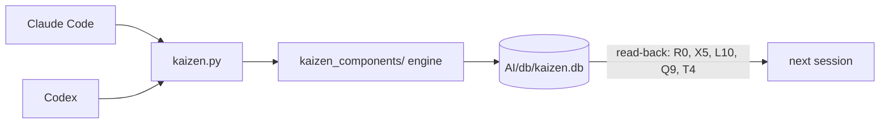

# Architecture

Agent Kaizen is a local **evidence/record layer** above AI coding agents (Claude Code, Codex) in a VS Code project. Agents remember; they do not prove. This harness gives every task, verification, artifact hash, prediction, and promoted lesson a durable, queryable record — written by any agent host through one CLI — so the next session starts from recorded evidence, not recollection.

## Operating loop — SAVMI

```text
SAVMI = Scope -> Adapt -> Verify -> Manage -> Improve
```

| Layer | Job | Typical outputs |
| --- | --- | --- |
| Scope | Understand intent and evidence | Iterative spec, assumptions, acceptance criteria |
| Adapt | Change the system within bounds | Execution contracts, patches, scripts |
| Verify | Decide if the work can proceed | Go/no-go result, proof, findings |
| Manage | Preserve and govern work data | DB records, hashes, reports, policy context |
| Improve | Decide what to improve next | Retrospective, next-cycle priorities |

## Data flow



Every agent host writes through one deterministic CLI into one database; the next session — whichever agent runs it — starts from records.

## Surfaces

| Surface | Role |
| --- | --- |
| `kaizen.py` | Deterministic write path + reports (the data-plane CLI) |
| `kaizen_components/` | Engine behind the CLI (schema, redaction, backends) |
| `AI/db/` | Local data plane: DB, exports, manifests, backups |
| `Kaizen_System.md` | Portable method for humans and agents |
| `CLAUDE.md`, `AGENTS.md` | Identical host instructions that point at the manuals |
| `evals/` | Command stubs + portable eval/learning surfaces |
| `setup/` | Install/bootstrap scripts + agent manual `SETUP.md` |

## Storage

Turso/libSQL-compatible database via `pyturso`, direct local file at `AI/db/kaizen.db`: MVCC mode, bounded retries, app-generated IDs, SHA-256 hashes for entries and artifacts. Backend-agnostic by design — records must stay structured, queryable, and written through deterministic paths, but the store can be swapped. Record search uses escaped-substring `LIKE` (bounded by each query's `--limit`); optional embedding backends (Ollama/PyTorch) add semantic evidence search when configured. Nothing touches the network unless you configure an optional backend.

Full command index and per-op behavior: [README.md](../README.md). Portable method: [Kaizen_System.md](../Kaizen_System.md).
