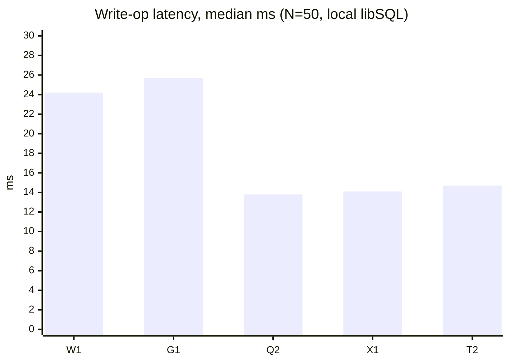
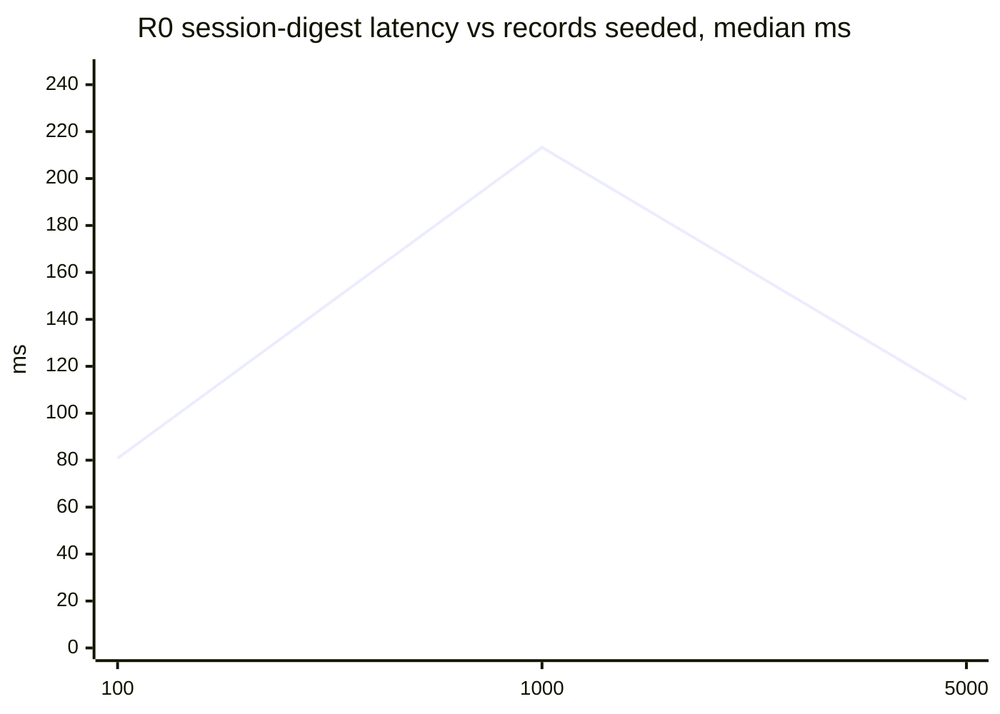
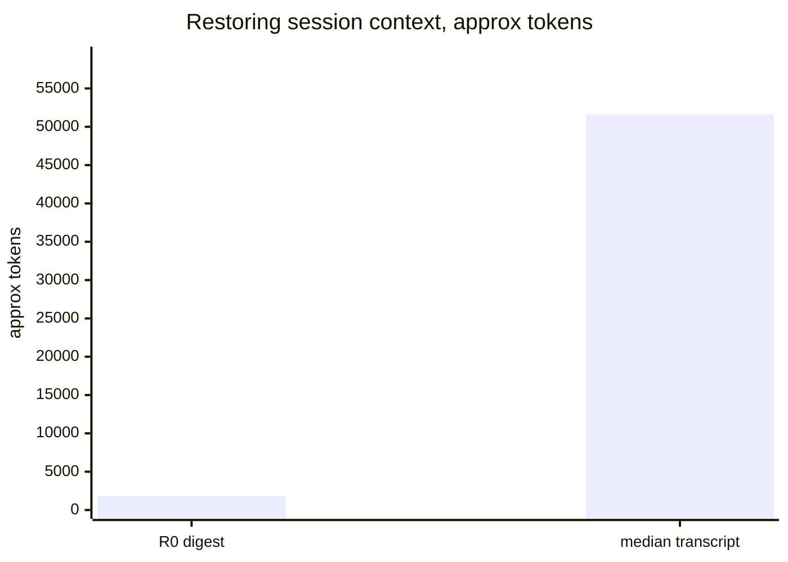

<!-- Generated by tests/bench_kaizen.py; do not edit by hand. -->

# Benchmarks

Repeatable local benchmarks for the Agent Kaizen harness: the real CLI code path, timed in-process against an isolated scratch data plane. Anyone can regenerate this file with one command (see **Reproduce**); numbers below are the committed reference run.

Reference machine: Windows-11-10.0.26200-SP0, AMD64, Python 3.12.10, pyturso 0.6.1. Generated 2026-07-03T23:15:29+00:00 (UTC), mode `full`, total 359.9s.

## Methodology

- Every operation runs through `kaizen_components.args.main()` in-process, so timings exclude Python interpreter startup but include argument parsing, schema checks, fresh DB connections, and commits — the per-op cost an agent actually pays.
- The whole run targets a throwaway `KAIZEN_REPO_ROOT` temp directory; the repo's own `AI/db/` is never read or written, and nothing touches the network.
- Percentiles are nearest-rank; the clock is `time.perf_counter`. Write ops run 3 warmup + 50 timed iterations each; read-back ops run 20 timed iterations per scale level.
- The scale phase seeds a mix of tasks, gotchas, failed verifications, policies, and eval scores so every query in the R0 session digest does real work; the `learned` table stays empty (its digest query is a constant-cost scan).
- Read-back latency can be non-monotonic across scale levels: the engine opens a fresh connection per query, and connection cost tracks the size of the MVCC write log, which the storage layer compacts on internal thresholds. A level measured right after a seeding burst (log large, not yet compacted) can read slower than a larger level measured after a compaction. Row count is not the whole story; log state matters too.
- Retrieval hit rate is a correctness gate, not a ranking measure: lexical mode orders by recency, so it is meaningful only because each marker phrase is unique to one document (expected value: 1.0, plus a negative-control query that must return nothing).
- Context recovery compares the `R0` digest payload against the text content of the median-sized local agent session transcript for this project. Token counts use the chars-divided-by-4 heuristic; only aggregate sizes are recorded, never content.

## Limits

- These numbers are **repository-local and illustrative**, not a portable benchmark: the context-recovery baseline is this project's own median session transcript, so the ratio reflects this repo's transcripts, not yours.
- Token counts are a `chars / 4` approximation, not a real tokenizer count.
- Retrieval hit rate is synthetic: each query targets a marker phrase unique to one seeded document, so it measures correctness (does the right doc come back), not ranking quality.
- Latency is machine- and state-dependent (see the MVCC write-log note above); treat the reference run as a shape, not a guarantee.

## Op Write Latency

| Op   | Alias            | n   | median ms | p95 ms | min ms | max ms |
| ---- | ---------------- | --- | --------- | ------ | ------ | ------ |
| `W1` | task-start       | 50  | 24.25     | 27.15  | 22.09  | 27.98  |
| `G1` | gotcha-add       | 50  | 25.7      | 27.29  | 23.57  | 28.18  |
| `Q2` | verification-add | 50  | 13.82     | 15.54  | 12.35  | 20.02  |
| `X1` | policy-add       | 50  | 14.12     | 16.14  | 12.77  | 16.25  |
| `T2` | score-add        | 50  | 14.74     | 16.42  | 13.68  | 17.82  |



## Session Digest At Scale

| Records seeded | R0 median ms | R0 p95 ms | X5 median ms | X5 p95 ms |
| -------------- | ------------ | --------- | ------------ | --------- |
| 100            | 80.78        | 84.55     | 6.7          | 7.26      |
| 1000           | 213.28       | 231.47    | 18.46        | 21.49     |
| 5000           | 105.79       | 117.69    | 8.5          | 9.2       |



The chart plots only `R0`; exact `X5` values remain in the table because plotting them on the `R0` scale makes the smaller series unreadable. If a mid-size level reads slower than a larger one, that may reflect the MVCC write-log effect described in **Methodology**—latency can follow log-compaction state as much as row count.

## Evidence Retrieval

| Step | Alias                | n   | median ms | p95 ms |
| ---- | -------------------- | --- | --------- | ------ |
| `E1` | evidence-ingest-file | 20  | 24.56     | 30.46  |
| `E3` | evidence-chunk       | 20  | 43.5      | 58.21  |
| `E4` | evidence-query       | 100 | 14.37     | 16.42  |

Corpus: 20 documents, 40 paragraphs each, 378 chunks total. Mode: `like`.

Hit rate over 20 marker queries: top-1 1.0, top-5 1.0; negative control clean: true.

Semantic mode: skipped (DENIED_BACKEND_UNCONFIGURED) — no embedding backend configured, which is the dependency-light default. Configure one and pass `--allow-semantic` to time vector search too.

## Context Recovery

What it costs to restore working context at session start: reading the `R0` session digest versus replaying a raw agent session transcript (the "just scroll up" baseline).

| Source | Size | Approx tokens (chars / 4) |
| --- | --- | --- |
| `R0` digest at 5,000 seeded records | 7,299 bytes | 1,825 |
| Median-sized session transcript, text content (of 20 sessions) | 206,232 chars | 51,558 |



Starting from records is about **28× cheaper** than replaying the median transcript — and the digest is curated state (active policy, open GOTCHAs, blocking verifications, lessons), not a wall of chat to re-read. The transcript baseline is measured from this project's own local agent session logs; only aggregate sizes are recorded, never content.

## Reproduce

```powershell
python tests\bench_kaizen.py
```

```sh
python tests/bench_kaizen.py
```

`--quick` runs a tiny variant into a temp directory (used by the test suite so this script cannot rot); `--out DIR` redirects all artifacts for a dry run; `--allow-semantic` keeps your embedding-backend environment variables and times `E4 --semantic` when a backend responds.
